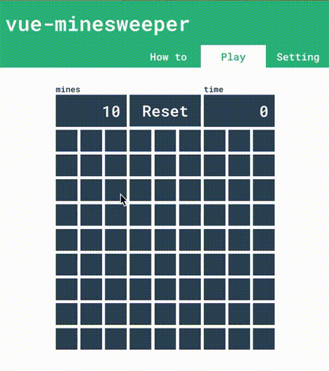

# vue-minesweeper




Vue.js の勉強用に作成したマインスイーパーです。
デプロイが正常完了していれば下記URLでプレイできます。

https://ksugimori.github.io/vue-minesweeper/

## Project setup
```
npm install
```

### Compiles and hot-reloads for development
```
npm run serve
```

### Compiles and minifies for production
```
npm run build
```

### Lints and fixes files
```
npm run lint
```
